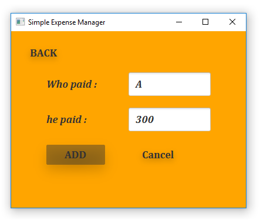
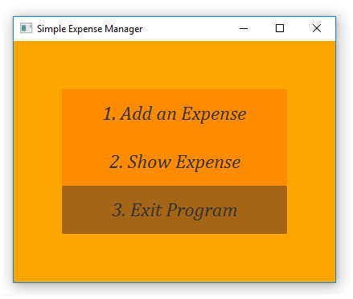

# Simple Expense Manager

## About the Project

The Simple Expense Manager is a JavaFX GUI application designed to manage expenses between three people. It provides a user-friendly interface for adding expenses, displaying expense details, and calculating the amount to be paid by each user.

The main menu of the application offers the following options:

1. Add an Expense: Allows users to add a new expense with the corresponding details, including the payer, recipients, and the amount.

2. Show Expense: Displays the expense summary, showing the amount that each user needs to pay to another user.

3. Exit Program: Terminates the application.

## Screenshots

Here are some screenshots of the application:

#### 1. Main Menu

#### 2. Add an Expense

#### 3. Show Expense

#### 4. Exit Program

## Prerequisites

To run the Simple Expense Manager, ensure that you have the following installed:

- Java Development Kit (JDK) 8 or above
- JavaFX SDK (included in JDK 8, separate download for JDK 11+)

## Getting Started

1. Clone the repository

2. Open the project in your preferred Java IDE.

3. Set up the JavaFX SDK in your IDE by configuring the module path or adding the necessary VM options. Refer to your IDE's documentation for instructions specific to your setup.

4. Build and run the application.

## Usage

1. Launch the application.

2. From the main menu, select the desired option:
   - To add an expense, choose "Add an Expense" and provide the necessary details.
   - To display the expense summary, select "Show Expense".
   - To exit the program, choose "Exit Program".

3. Follow the on-screen instructions to input data and navigate through the application.

## Contributing

Contributions to the Simple Expense Manager project are welcome! If you have any suggestions, bug fixes, or new features to add, please feel free to submit a pull request.

## License

This project is licensed under the [GNU License](LICENSE).

---

Feel free to modify and customize this README file based on your project's specific details and requirements.